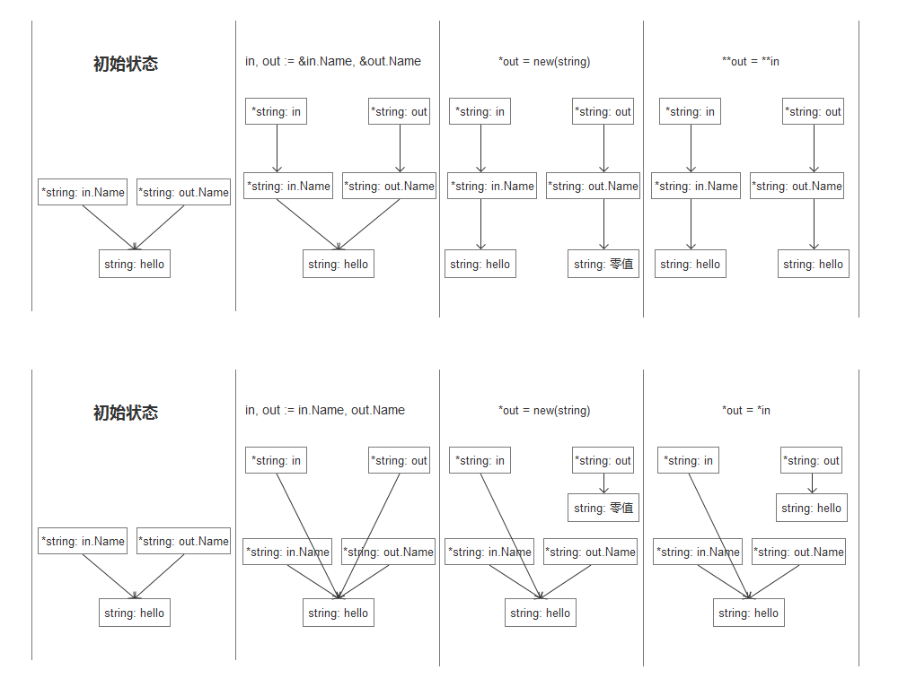

# 元组赋值

元组赋值是另一种形式的赋值语句，它允许同时更新多个变量的值。
在赋值之前，赋值语句右边的所有表达式将会先进行求值，然后再统一更新左边对应变量的值。
这对于处理有些同时出现在元组赋值语句左右两边的变量很有帮助，例如我们可以这样交换两个变量的值：

```go
x, y = y, x
```

# 可赋值性

## 显式赋值

```go
i := 1
```

## 隐式赋值

函数调用会隐式地将调用参数的值赋值给函数的参数变量。
一个返回语句将隐式地将返回操作的值赋值给结果变量。
一个复合类型的字面量也会产生赋值行为。

```go
medals := []string{"gold", "silver", "bronze"}
```

相当于对每个元素进行隐式赋值操作

```go
medals[0] = "gold"
medals[1] = "silver"
medals[2] = "bronze"
```

## 深拷贝浅拷贝

**赋值指针是`浅拷贝`**

示例

```go
a := new(int)
*a = 1
b := a
fmt.Println(a) // 0xc00000a098
fmt.Println(b) // 0xc00000a098
```

类型为*int的两个值a、b值记录了对象的地址，拷贝的是地址信息

**赋值对象是`深拷贝`**

示例：

```go
a := new(int)
*a = 1
b := *a
fmt.Println(a)  // 0xc00000a098
fmt.Println(&b) // 0xc00000a0b0
```

## 结构体深拷贝示例

```golang
package model

type Cat struct {
	Name *string `json:"name,omitempty"`
	Age  uint8   `json:"age,omitempty"`
}

// 写法一
func (in *Cat) DeepCopy1(out *Cat) {
	*out = *in
	if in.Name != nil {
		inap, onap := &in.Name, &out.Name
		*onap = new(string)
		**onap = **inap
	}
}

// 写法二
func (in *Cat) DeepCopy2(out *Cat) {
	*out = *in
	if in.Name != nil {
        out.Name = new(string)
        *out.Name = *in.Name
	}
}
```

对于写法一很容易就写成下面的程序，这是错误的

```golang
inap, onap := in.Name, out.Name
onap = new(string)
*onap = *inap
```



## 小结

对于赋值类型必须匹配，nil可赋值给任何指针或引用类型的变量。

对于`==`或`!=`的比较也是有赋值关系：任何类型的值相等比较，第二个值必须是对第一个值类型对应的变量是可赋值的。